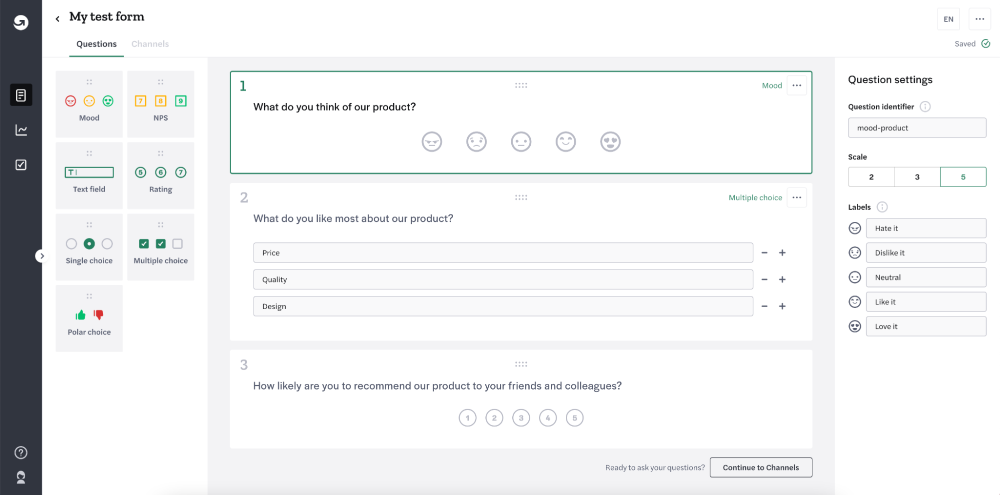
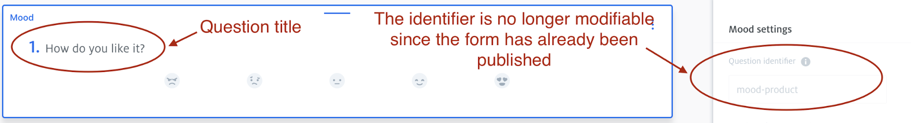
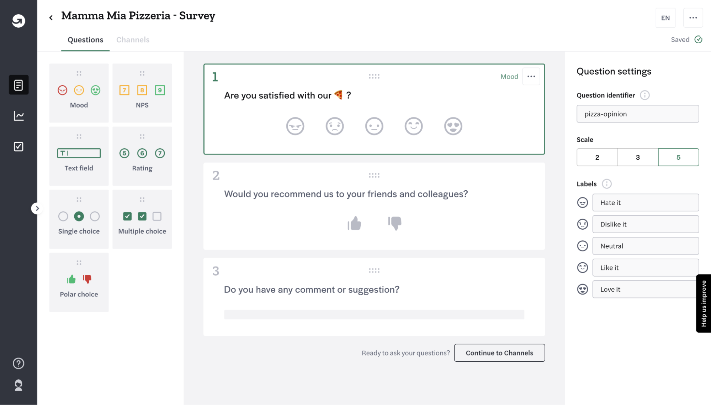
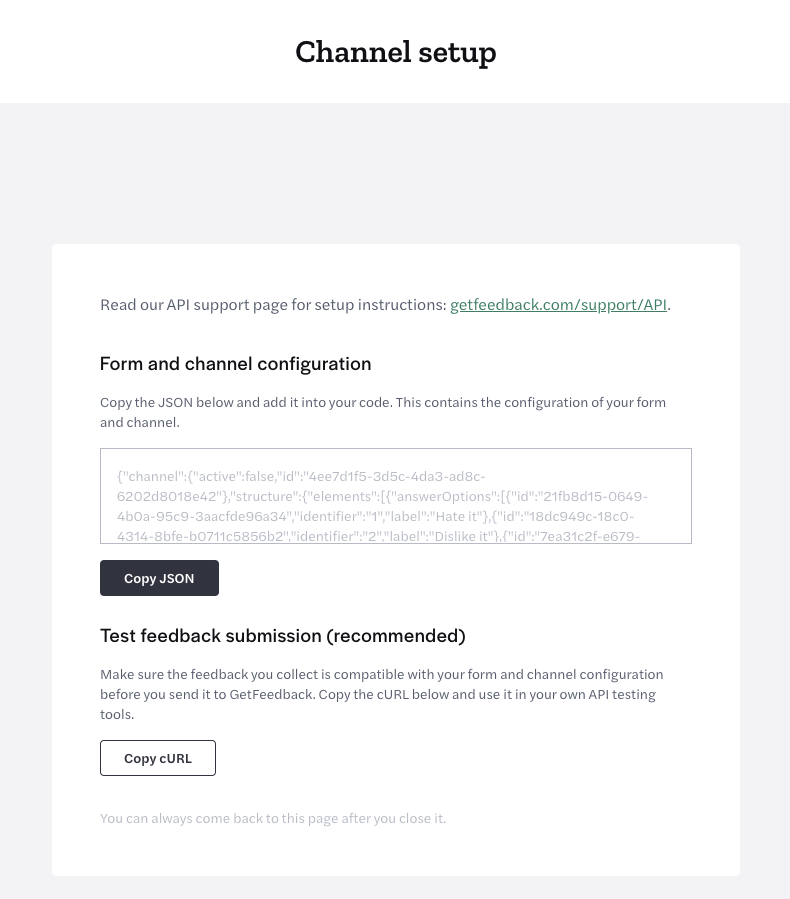
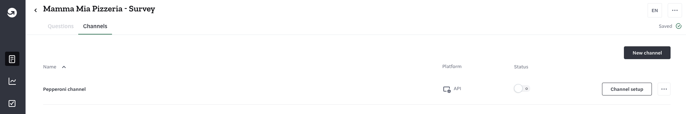
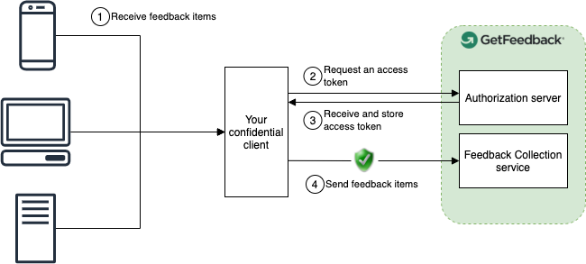

# GetFeedback Digital

## Document Version Management

<table>
  <tr>
   <td>Date
   </td>
   <td>Version
   </td>
   <td>Changes
   </td>
  </tr>
  <tr>
   <td>24-10-2021
   </td>
   <td>1.0
   </td>
   <td>First version
   </td>
  </tr>
</table>

## Introduction

With the embedded listener you’ll be able to take full control over the collection of your CX data.

The added flexibility of creating your custom solution enables you to collect feedback in places where you cannot use our Web, App, or Email collection clients. An example would be web pages where you can’t use 3rd party JavaScript or closed environments such as ATMs or vending machines.

The data that you collect via the API channel will be available for analysis straight away in the GetFeedback Platform via Workspaces, thus can also be aggregated with any data that is already synced into workspaces (Web Campaigns, App Campaigns, In-Page, GetFeedback Direct).

Being in charge of displaying your forms does not mean losing the easy and convenient way GetFeedback offers to create and manage your surveys: our new form editor will remain available to you in its entirety, allowing you to modify and update your surveys on the fly.

## Basic concepts

### Forms

A Form is a data collection instrument used for capturing insights and feedback. Forms comprise of a sequence of one or more questions and some additional settings related to:

* How (and which of) those questions will be shown once the form is presented.
* What information about the participants should be gathered.



Every form is identified by an **id** which is a universally unique identifier (UUID), and a **title**, which is intended to be the human-readable counterpart. Even though it's discouraged, it is possible to assign the same title to multiple forms.

#### Publishing a form

It's important to understand the difference that exists between _draft_ and _published_ versions of a form. The drafting mechanism allows existing forms that are live and gathering feedback not to suffer from accidental modifications that haven't been explicitly validated first. Forms in the process of being set up or being actively modified are always in a _draft_ state. All the changes made to a "draft" form are not available to the people who are taking the survey, and they can be rolled back anytime to the latest _published_ version.

When the changes to the form have been finalized and are ready to be made available to your customers, you can publish the form with the dedicated button. The publish action will be available in the editor as soon as any modification occurs. Also, newly created forms will automatically be published as soon as the first linked channel is created (more on channels at [Channels](#channels)).

### Questions

Questions, also known as elements, are the basic building blocks of GetFeedback Digital, the components that will gather the feedback of your users. We currently support many different types of questions, and each one of them has its own specific settings and peculiarities.

* NPS
* Mood
* Choice (with single and multiple selections)
* Polar
* Rating
* Text

Each question type also shares some common properties: an **Id**, an **Identifier,** and a **Title**. As for the form, the question's id is a UUID that uniquely identifies it, while the Identifier is the human-readable counterpart. The identifier plays a key role in the analysis of the answers gathered from a specific question, and once the form is published it won’t be possible to change it again, so make sure to set a meaningful value for it.
As a best practice, we recommend using a concise description of the question used and the subject, where each word is concatenated with a dash `-`. For example, a question with the title set to “How would you rate your experience on our website?” could have an identifier similar to “mood-website”.



### Channels

A channel acts as the distribution mechanism of a form, allowing to display the same survey in multiple applications and manage them separately. In other words, if you want to distribute the same survey on multiple platforms, such as your website and your mobile app, channels will enable you to do that without the hassle of duplicating the form.

We do support multiple platforms on our channels, and even though some of them are supported by our first-party clients, the one relevant for this guide is the so-called “API” platform, also known as the embedded listener, which is the only type that does not come with a GetFeedback Digital native Client to render the linked survey.

As previously mentioned, the embedded listener provides a mechanism to integrate your application with GetFeedback Digital when it’s not possible to use any GetFeedback’s available solutions. The embedded listener allows getting the configuration of a survey in a JSON format and lets the implementer choose how the configuration will be used. Again, a few examples could be:

* development of a Client (or SDK) to render surveys and submit feedback items
    * in a programming language not supported by GetFeedback Digital.
    * when it’s not possible to use any of GetFeedback’s available clients.
* Syncing of feedback data gathered from another platform to GetFeedback Digital.

The configuration-based approach of the API channel allows the highest degree of flexibility giving you the power to shape your custom solution with our smallest building blocks.

### Feedback items

A feedback item is any qualitative or quantitative response or reaction, usually made up of evaluative or corrective information, from a customer or user about a particular action or process they experienced with the organization they are interacting with. On top of that, feedback items may also encapsulate additional information (metadata) about the context in which the customer was while filling out the survey. With the API channel, you will get to send the feedback items to our endpoints with the data you collected from your application.

## Developer guide

### Getting started

To get started with the embedded listener, you need to:
1. Create a form with the form editor
2. Create an embedded listener channel for that form.

Once you are set up, you can retrieve the JSON configuration of the form and start submitting feedback items through the APIs.

Before jumping to the examples, we recommend that you begin by reading the [basic concepts](#basic-concepts) in order to become familiar with the jargon of this guide. The following sections describe the steps to be performed considering a pizzeria asking their customers for some feedback.

### Creating a form with the form editor

On your GetFeedback dashboard, go to the form editor and set up a form according to your needs.

In our example we create a form with three elements:
* A mood element with identifier _pizza-opinion _and title_ Are you satisfied with our pizza?_
* A polar element with identifier _recommend-yes-no _and title_ Would you recommend us to your friends and colleagues?_
* An open text field with identifier _comments-and-suggestions _and title_ Do you have any comments or suggestions?_

This data will later be collected in its JSON representation, so it is important to pay attention to the values you choose.



Once happy with our form, let’s hit the CHANNELS tab on top to proceed to the next step.

### Creating an embedded listener with the channel editor

Once we have created our form, we can create a channel for it by clicking the “CREATE A NEW CHANNEL” button. The feedback will be collected and categorized via the channel for later segmentation.

In order for the **first distribution channel** to be created, you’ll be prompted to publish the changes made to the form. This means that the first version of the form will be published and, from that point on, it will no longer be possible to modify that form’s questions’ identifiers.

We’ll be gathering feedback from our custom-built _Pepperoni-app_, hence we decide to name this channel the _Pepperoni channel_.

### Copying the JSON configuration from the form editor

We can now copy the JSON configuration of the form and channel we just created from the channel setup screen.



The configuration reported in the Channel Setup page always represents the latest published version of the Form and some additional information related to the channel. You need this configuration to be able to render the form and submit feedback items from your application. You can come back to this configuration anytime. From the form overview page, click on the form you want the configuration of, then click on the “Channels” tab. On this page, locate the channel you created and click on the corresponding button “CHANNEL SETUP”.




What follows is the JSON configuration of the form we just created.

```
{
  "channel": {
    "active": false,
    "id": "4ee7d1f5-3d5c-4da3-ad8c-6202d8018e42"
  },
  "structure": {
    "elements": [
      {
        "answerOptions": [
          {
            "id": "21fb8d15-0649-4b0a-95c9-3aacfde96a34",
            "identifier": "1",
            "label": "Hate it"
          },
          {
            "id": "18dc949c-18c0-4314-8bfe-b0711c5856b2",
            "identifier": "2",
            "label": "Dislike it"
          },
          {
            "id": "7ea31c2f-e679-43a9-8ece-96792d6a47ed",
            "identifier": "3",
            "label": "Neutral"
          },
          {
            "id": "fa2b781d-54ba-4f3c-9636-2105a9a3378b",
            "identifier": "4",
            "label": "Like it"
          },
          {
            "id": "9cf2430c-d935-4881-b53d-9596c5629e62",
            "identifier": "5",
            "label": "Love it"
          }
        ],
        "id": "695e8598-a04e-4c9e-8a4c-d0b9b3da035e",
        "identifier": "pizza-opinion",
        "title": "Are you satisfied with our 🍕 ?",
        "type": "mood"
      },
      {
        "answerOptions": [
          {
            "id": "b748a054-5360-4dff-81fe-27abc7890df5",
            "identifier": "positive",
            "label": "Like"
          },
          {
            "id": "4e959ea7-1114-44dd-b7dd-47146e58e285",
            "identifier": "negative",
            "label": "Dislike"
          }
        ],
        "id": "fdd0fe35-0ffe-4484-9380-82ba9e158219",
        "identifier": "recommend-yes-no",
        "title": "Would you recommend us to your friends and colleagues?",
        "type": "polar"
      },
      {
        "id": "1b3aa244-4f79-4e84-84d8-68c9039c796a",
        "identifier": "comments-and-suggestions",
        "title": "Do you have any comment or suggestion?",
        "type": "text"
      }
    ],
    "mainLanguage": "en-US",
    "version": 0
  }
}
```

We can find the following properties in the JSON configuration:

* **Channel:**
    * **Id:** The id of the channel. Needed in order to submit feedback items to our RESTful endpoints.
    * **Active:** a status that indicates if the survey should be displayed or not, but it’s up to the implementer to define its actual behavior.
* **Structure:**
    * **Version:** a positive integer that specifies the version of the form.
    * **Elements:** an array of objects representing each element of the form. Each element has the id, the identifier which is user-defined, its type, and the title. Depending on the type, an element can have additional properties, for instance, an array of answer options, each one with its own id, identifier, and label. Note that the elements are ordered as they appear in the editor, but the answer options’ order, if present, is not guaranteed.
    * **MainLanguage:** a locale string compliant with ISO 639-2 defining the main language of the form. For now, a form can only have one language.

Regarding the elements, as opposed to the title, the identifier **SHOULD NEVER** be shown to any user taking the survey, only the question’s title should be displayed when the survey is rendered. As the implementer, you must take this into consideration when developing the client’s interface.

It's also important to note that all feedback items sent via a form are validated against the questions present in said form. Specifically, as the implementer, you need to make sure that the answers you're submitting (those inputted by the user who filled the form) match certain criteria based on the question types.

### How to structure a Feedback Item

A feedback item is a JSON document that allows you to encapsulate user feedback, enriched with additional information and context, to send to GetFeedback. The JSON reported in this section represents an example of a feedback item compliant with the form and channel previously created.

```
{
 "channel": {
   "id": "4ee7d1f5-3d5c-4da3-ad8c-6202d8018e42"
 },
 "form": {
   "structureVersion": 0
 },
"client": {
   "ip": "127.0.0.1",
   "userAgent": "Mozilla/5.0 (Macintosh; Intel Mac OS X 10_15_7)"
 },
 "userInput": {
   "695e8598-a04e-4c9e-8a4c-d0b9b3da035e": "5",
   "fdd0fe35-0ffe-4484-9380-82ba9e158219": "positive",
   "1b3aa244-4f79-4e84-84d8-68c9039c796a": "It was a really good pizza"
 },
 "customerInput": {
     "context" : {
       "myCustom": "Variable"
   }
 },
 "submitted": true
}
```


Feedback items can be submitted to GetFeedback through our APIs. It is possible to create a new feedback item or update an existing one. Depending on the operation, you can have different properties.

#### Creation

The payload of the creation request **MUST** have the following properties present at the root level:

* **Channel (object)**: Through the channel, the item will be linked to a specific form
    * Id (UUID): Represents the ID of the channel you want to send the feedback item through.
* **Form (object):**
    * structureVersion (int): represents the form version the feedback item relates to. It will be used in order to validate a feedback item against a specific version of the form’s structure.

The payload **CAN** have the following properties:

* **Client (object):** An object representing the client who collected the feedback item. Check out the API reference to learn what properties are accepted.
* **UserInput (object):** The answers to the questions in the form.
    * Every key MUST be a question’s id (uuid).
    * Every value represents _answers_. Depending on the element type, they MAY be a string or an array of strings. The value MUST be the _identifier_ of the answer option in case of closed answer elements, or an array of identifiers in case multiple answers are allowed.
* **CustomerInput (object):**
    * **Context (object)**: Extra context you wish to send along the item itself. Be aware that if _CustomerInput_ is present, _Context_ MUST NOT be null.
* **Submitted (bool):** Whether or not the user has completed the full feedback form or has dropped out midway through. It defaults to false if not specified and it can only be set to true. “Completing” the form does not necessarily mean filling all the questions, it may just mean that the user taking the survey reached the last question of the form, skipping some of the previous ones. It’s up to the implementer to choose when to set this flag to true, in accordance to their requirements.
* **CollectedAt (string)**: The datetime the feedback item has been collected. It can be lower than or equal to _now_. If a future datetime is provided, it will be defaulted to _now_.

Creating a feedback item generates an id that can be used to refer and update the feedback item itself.
**The id is returned via the Location header of the HTTP response.**

#### Update

A feedback item can be submitted by sending all data related to it in a single request. Alternatively, we allow feedback items to be enriched with additional answers for up to 2 weeks after their original creation.

Note that the only part of a feedback item that can be modified cumulatively (by adding new data) is UserInput.
**Any addition or modification to other properties will be ignored**.

The payload **MUST** contain the following properties:

* **Sequence (int)**: a strictly increasing integer. It must always start from 1, and goes up to a limit of 9999.  This value is used in order to guarantee the correct processing of your data.

The payload **CAN** have the following properties:

* **UserInput**
* **Submitted**

### Securing your data

At GetFeedback we value the privacy and security of your data, for this reason, we do not allow unauthenticated requests to our feedback collection services.

In order to submit feedback items via HTTP requests, you always need to provide an access token. The procedure to request an access token is described in the following sections.




#### Confidentiality

As an implementer, you need to make sure that every feedback is submitted by a confidential Client. [Confidential applications](https://datatracker.ietf.org/doc/html/rfc6749#section-2.1) can hold credentials in a secure way without exposing them to unauthorized parties. They require a trusted backend server to store the secret(s).

If your credentials are leaked in a public context, there’s a chance they’ll be acquired by a malicious party, which in turn could start interfering with the submission of your data.

For this reason, we **highly suggest routing all the data your services acquired through a trusted backend service, which then proxies the requests to our collection services embedding the access token as an authorization header.**

#### Requesting an access token

After purchasing the product you’ll be provided with the client credentials necessary to acquire access tokens. If you haven’t received those credentials make sure to reach out to the person who was responsible for purchasing the product or to GetFeedback customer support.

An example cURL request looks like the following (make sure to replace the `client_id` and `client_secret` values with your client credentials):


```
curl --request POST \
  --url https://getfeedback.eu.auth0.com/oauth/token \
  --header 'content-type: application/json' \
  --data '{
    "client_id":"<your-clientId>",
    "client_secret":"<your-clientSecret>",
    "audience":"https://api.usabilla.com",
    "grant_type":"client_credentials"
  }'
```

The response should look like the following:

```
{
  "access_token": "xxxxxx",
  "expires_in": 86400,
  "token_type": "Bearer"
}
```

The value of the `access_token` property is what you must provide in order to authorize your request when submitting feedback items to our APIs.

The default token duration is one day, after which the token will expire and will have to be renewed.

### Putting everything together

Now that we know how to obtain an access token, let’s make sure we put everything together and submit our first feedback item.

So, let’s say our pizzeria collected the following information:

* A Mood of 4.
* A “positive” Polar.
* “More cheese!” as a suggestion.
* The end customer ip and user-agent.

Then, the cURL request to submit such data would look like the following:

```
curl --request POST \
  --url https://collect.getfbk.com/v2/feedback \
  --header 'content-Type: application/json' \
  --header 'authorization: Bearer <access-token>' \
  --data '{
    "channel": {
      "id": "4ee7d1f5-3d5c-4da3-ad8c-6202d8018e42"
    },
    "form": {
      "structureVersion": 0
    },
    "client": {
      "ip": "127.0.0.1",
      "userAgent": "Mozilla/5.0 (Windows NT 10.0; Win64; x64) AppleWebKit/537.36 (KHTML, like Gecko) Chrome/74.0.3729.169 Safari/537.36"
    },
    "userInput": {
      "695e8598-a04e-4c9e-8a4c-d0b9b3da035e": "4",
      "fdd0fe35-0ffe-4484-9380-82ba9e158219": "positive"
    },
    "submitted": false
  }'
```

A request to update the previously submitted item would look like this.
Again, remember to replace the `feedback_item_id` value with the id returned upon submitting the previous request:

```
curl --request PATCH \
  --url https://collect.getfbk.com/v2/feedback/<feedback_item_id> \
  --header 'content-Type: application/json' \
  --header 'authorization: Bearer <access_token>' \
  --data '{
    "userInput": {
      "1b3aa244-4f79-4e84-84d8-68c9039c796a": "More cheese!"
    },
    "sequence": 1,
    "submitted": true
  }'
```

## Restrictions and limitations

#### Channel configuration

Currently, it is not possible to programmatically retrieve the JSON configuration of a Form from a dedicated API endpoint. For the time being, the JSON configuration of a Form will only be available on the Channel set-up page in the official GetFeedback web application.

**This means that any changes made to a Form, even if published, will require a manual update on your application to become effective.**


#### Rate limiting

The current rate-limit for total number of **requests per second** **is 10**. Any request exceeding the limit will be blocked by our services.

If you’re planning on exporting a large set of data that might exceed the limit, please reach out to customer support to discuss your use case.


#### Exception handling

It’s the implementor’s responsibility to ensure that the outcome of a feedback submission did not result in an exception. Please note that an exception may be raised on a later stage as each feedback item accepted by our collection endpoint will be further processed.

Any unhandled exception may result in potential data-loss, hence, re-submitting failed requests in case of temporary service unavailability is a must if you want to guarantee the completeness of your data.
